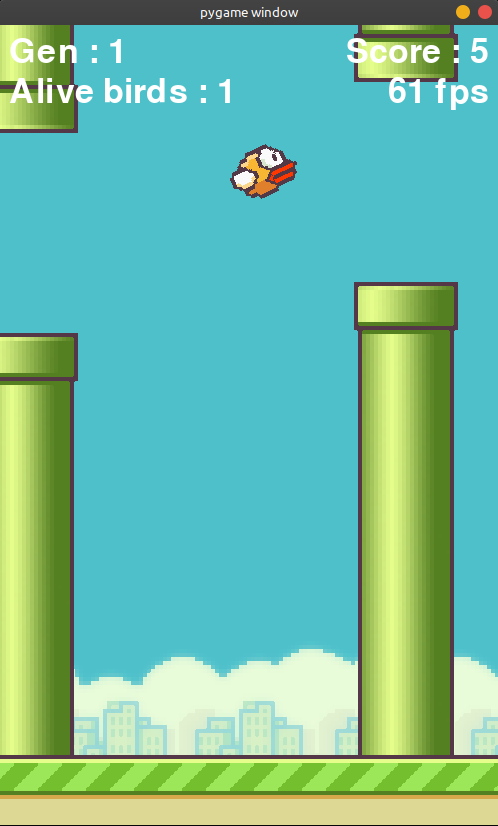

# Flappy Bird AI using NEAT

# This program is a replica of the famous Flappy Bird game with Pygame and the neat-python module.

## [Video demonstration !](https://youtu.be/00ODtHO91do)

This uses the Neuroevolution of augmenting topologies (NEAT) to create a super effective neural network allowing the AI to perform like a charm after a very low amount of generations. Collisions are pixel perfect, allowing the game to play smoothly and collisions to be super accurate (inaccurate collisions being the main source of frustration in most of public Flappy Bird clones.)




The neural network shape and input/output neurons

# Dependencies

You will need to install the pygame and neat dependencies by running the following commands (commands may vary depending on your installation and/or your operating system)

```bash
python3 -m pip install neat-python
python3 -m pip install pygame
```

# Settings

You can try and tweak the settings in the configuration file named `config-feedforward.txt`.

Interesting things to play around can be the size of the population for example.

# Thanks

Thanks for Tech With Tim for his tutorial !
